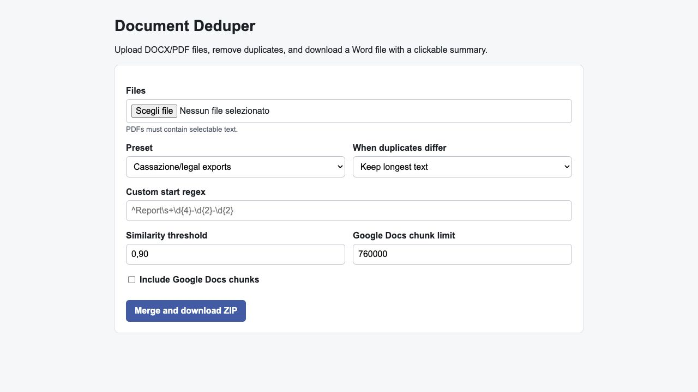

# Document Deduper

Merge collections of `.docx` and `.pdf` files, split them into document records, remove duplicates, and export a readable Word file with a clickable summary.

It was born from Italian Cassazione case-law exports, but the splitter can also work with custom start markers for other document collections.

## Features

- Import `.docx` and text-based `.pdf` files.
- Presets for Cassazione-style exports from common legal databases.
- Optional custom regex to decide where each document starts.
- Hybrid deduplication using metadata, text fingerprints, and same-number similarity.
- Word output with:
  - clickable summary;
  - one record per page;
  - internal back-to-summary links;
  - source and duplicate provenance.
- Optional Google Docs chunks under a configurable character limit.
- Tiny local web UI, no Streamlit or Node required.

## Install

```bash
python -m venv .venv
source .venv/bin/activate
pip install -e .
```

## Web UI

```bash
document-deduper web --host 127.0.0.1 --port 8765
```

Then open [http://127.0.0.1:8765](http://127.0.0.1:8765), upload files, choose options, and download the ZIP.



## CLI

```bash
document-deduper merge input1.docx input2.docx input3.pdf \
  --out outputs/merged.docx \
  --manifest outputs/manifest.csv
```

Useful options:

```bash
document-deduper merge *.docx *.pdf \
  --preset cassazione \
  --similarity 0.90 \
  --prefer longest \
  --google-docs-dir outputs/google-docs-parts \
  --google-docs-limit 760000
```

For other collections, pass a custom start regex:

```bash
document-deduper merge reports/*.docx \
  --preset custom \
  --start-regex '^Report\\s+\\d{4}-\\d{2}-\\d{2}'
```

## Presets

- `cassazione`: recognizes many Italian Supreme Court export patterns, including `Cassazione penale sez...`, `Sentenza ... n. ... Data udienza`, `Ordinanza ... n. ...`, and `Sentenza | 20xx` blocks.
- `custom`: uses only your `--start-regex`.
- `whole-file`: treats each uploaded file as one document.

## Notes

- PDFs must contain selectable text. Scanned PDFs need OCR first.
- Google Docs has conversion limits for very long documents, so the app can create smaller chunks.
- The project does not upload your documents anywhere; the web UI runs locally.
